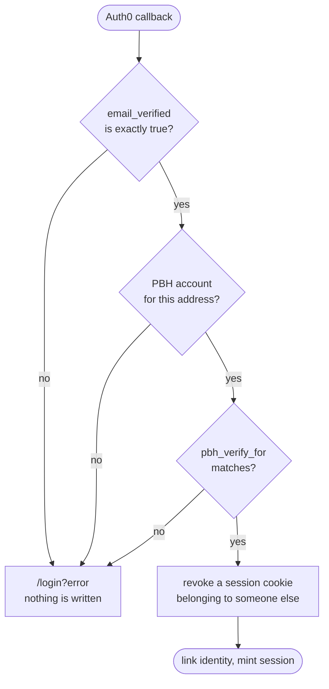

# The Auth0 verify leg

Auth0 replaces the magic link. It authenticates and it proves the address;
Auth.js still owns the session. Below is the path a brand-new customer takes
from the signup form to a verified row, and the four things that can refuse
them on the way back.

Review aid for PR #85 (`tuily/auth0-provider` → `staging`). The durable
description of the flow lives in [`auth.md`](auth.md) and
[`booking-flow.md`](booking-flow.md).

## Signup → verified

```mermaid
sequenceDiagram
    autonumber
    actor B as Browser
    participant P as PBH app
    participant D as Postgres
    participant A as Auth0

    B->>P: submit form, signupAction
    Note over P: refuse if AUTH0_* unset —<br/>before the insert, not after
    P->>D: INSERT users, emailVerified null
    P-->>B: Set-Cookie pbh_verify_for<br/>signed, 30 min, names the address
    P-->>B: 302 /authorize<br/>login_hint + prompt=login
    B->>A: Universal Login
    A-->>B: emails a code, customer enters it
    A-->>P: 302 /api/auth/callback/auth0<br/>code, via the browser
    Note over P: signIn callback — four gates<br/>email_verified === true · PBH account exists<br/>binding matches · foreign session revoked<br/>any refusal lands on /login?error, nothing is written
    P->>D: link accounts row, INSERT sessions
    P-->>B: Set-Cookie session, 302 /?booking=resume#booking
    P->>D: after&#40;&#41;: audit login · stamp email_verified · welcome email
```

`verifyEmailAction` re-enters at the `pbh_verify_for` step, for a customer who
abandoned at the Auth0 screen and came back on their booking cookie.

## The four gates, in the order they run

1. **The address is verified at Auth0.** `profile.email_verified` must be
   exactly `true` — not truthy, not `"true"`. This is what makes
   `allowDangerousEmailAccountLinking` safe: linking attaches the Auth0
   identity to whichever PBH row holds that email, so an unverified claim
   would hand over any account to anyone who types its address.
   — `apps/marketing/src/lib/auth0-gate.ts`

2. **A PBH account already exists.** Login-only: accounts are born in the
   booking flow, so an unknown address is refused before the adapter is
   reached. `createUser` throws as a second backstop.
   — `apps/marketing/src/auth.ts`, `lib/auth-user.ts`

3. **It is the address the trip was for.** `login_hint` only pre-fills the
   field. Edit it and you verify a different account while your own stays
   unverified — and the confirm step then holds you there for good. The signed
   `pbh_verify_for` cookie names the address the leg must land on. Only the
   booking actions issue it, so a header sign-in is untouched.
   — `packages/booking/src/server/verify-binding.ts`

4. **No one else's session is holding the browser.** Auth.js links a new Auth0
   `sub` to whoever the session cookie names, without comparing addresses — on
   a shared or family browser, a permanent and silent account takeover. The
   foreign row is deleted first, so the link falls through to the by-email path
   gate 1 exists to protect.
   — `apps/marketing/src/lib/session-revoke.ts`

## Who owns the session

Auth0 authenticates. Auth.js still holds the session, on the `database`
strategy, because the timeouts compliance signed off on are ours to enforce and
checkout mints a session server-side the moment payment verifies.

| | |
|---|---|
| Idle | 15 minutes, slid forward on every request (`updateAge: 0`) |
| Absolute | 8 hours from `sessions.created_at`, enforced by hand in `getSessionAndUser` — Auth.js only slides |
| OAuth leg | 30 minutes for the PKCE, state and nonce cookies — the customer leaves to find a code, often on another device |
| Binding | 30 minutes, matching the leg, then dropped by `getBookingResumeState` |
| At checkout | keep the session if it is theirs; revoke and re-mint if it is not — never orphan a row |

## Two places the flow is deliberately rude

**`prompt=login` on every leg.** Auth0's SSO cookie survives a PBH sign-out.
Without forcing re-authentication, a new customer on a browser someone else
used would be silently authenticated as that person — stamping the wrong row
and mailing them a second welcome. The address is already in `login_hint`, so
it costs one screen.

**Sign-out makes a second trip.** Deleting our row is half a sign-out.
`signOutAction` hands back `/v2/logout?returnTo=siteBaseUrl()` — the fixed
origin, never the request `Host`, which on a preview is a new hostname per
build and would not be in the Allowed Logout URLs.

## Still open

Everything above runs against a **personal Auth0 account**. Nothing in the code
assumes one — issuer, client id and secret are per-environment env vars — but
production needs Linus's application, its four callback and logout origins
*Disable Sign Ups* on the connection, and a BAA. The sign-in throttle this PR
deletes now has to come from that account's Attack Protection, which nobody has
confirmed is on.
