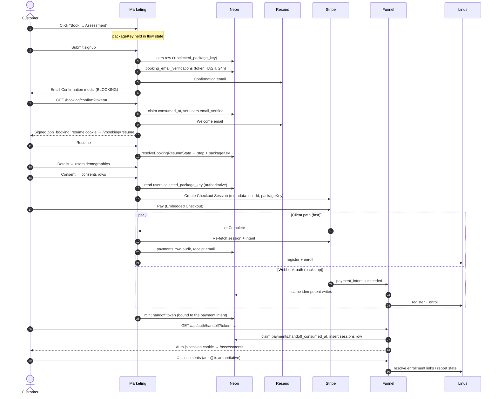
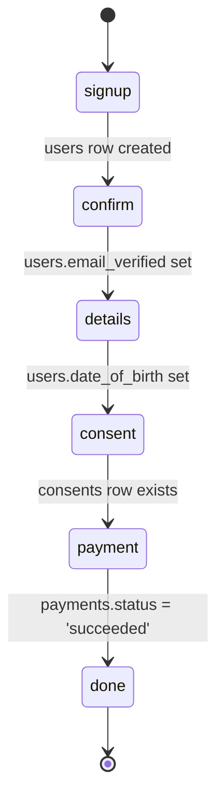

# Booking flow: marketing → funnel

How a customer goes from a package card on the marketing site to a signed-in
assessments page on the funnel, and what is written along the way.

Kept next to the code on purpose: when the flow changes this should change in the
same PR, and it should be obvious when it hasn't.

---

## Why there are two apps

| | Owns |
|---|---|
| **Marketing** — `primarybrainhealth.com` (`apps/marketing`) | The booking section, the whole booking modal, and Stripe Checkout |
| **Funnel** — `app.primarybrainhealth.com` (`apps/funnel`) | The Auth.js session, `/assessments`, report downloads, and the **only** Stripe webhook endpoint |

They share `@pbh/db` (one Neon database), `@pbh/booking/server` (every write
path), `@pbh/emails`, `@pbh/linus` and `@pbh/payments`.

One fact explains most of the design: **they are different origins, so marketing
cannot set the funnel's session cookie.** That is why there is a signed handoff
token, why the resume cookie exists, and why `createSessionForUser` returns a
cookie descriptor instead of setting one.

---

## The happy path

---

## Where a customer resumes

The email-confirmation step is **blocking**, so every customer leaves the site and
comes back to a fresh page. Their step is therefore recomputed from persisted
state — never from anything the browser claims.

`resolveBookingResumeState` (`packages/booking/src/server/resume.ts`) is the
authority. If this diagram and that function disagree, the function is right.

---

## Step by step

All server actions live in `apps/marketing/src/components/booking/actions.ts` and
`…/payment/actions.ts`; they are thin wrappers over shared cores in
`packages/booking/src/server/`.

| Step | Client | Action | Shared core | Writes |
|---|---|---|---|---|
| Landing | `BookingSection` → `PackageCard` | — | `ASSESSMENT_PACKAGES` | — (choice held in flow state) |
| Signup | `SignupForm` | `signupAction` | `createAccountCore` | `users` row incl. `selected_package_key`; audit `signup` |
| — | — | — | `sendBookingConfirmation` | `booking_email_verifications`; audit `email_verification_sent` |
| Confirm | `EmailConfirmationStep` | `GET /booking/confirm` | `consumeBookingConfirmation` | `consumed_at`, `users.email_verified`; audit `email_verified` |
| Resume | `BookingStepFlow` (on mount) | `getBookingResumeState` | `resolveBookingResumeState` | — (read only) |
| Details | `DetailsForm` | `detailsAction` | `completeProfileCore` | `users` demographics (DOB, zip, state, phone, gender, education, patient names) |
| Consent | `ConsentForm` | `consentAction` | `recordConsentCore` | two `consents` rows — `wellness` + `hipaa_npp` — with `ip_hash` + `user_agent` |
| Payment | `PaymentStep` | `createAssessmentCheckoutSession` | `createCheckoutSessionCore` | audit `payment_pending`; Stripe Session |
| Fulfilment | — | `finalizeCheckoutSession` | `recordSucceededPayment` | `payments` row incl. `package_key`; audit `payment_succeeded` |
| Enrollment | — | — | `registerAndEnrollUserById` | `users.linus_participant_id`, `linus_enrollments` |
| Handoff | `DoneStep` | `createAssessmentHandoffUrl` | `createHandoffForLatestPayment` | — (signs a token) |
| Sign-in | — | `GET /api/auth/handoff` | `redeemHandoffToken` | `payments.handoff_consumed_at`, `sessions` row; audit `login` |

### The chosen package

Captured at signup and stored on `users.selected_package_key`, because the
confirmation gate destroys in-memory state before payment. That stored value —
not the key the client re-sends — is what `createCheckoutSessionCore` charges.
Trusting the client would let someone drive the $449 flow while checking out at
the $149 price, and fulfilment would accept it, since it validates the amount
against whichever package the client named.

---

## Fulfilment runs twice, on purpose

Two paths race after a successful payment, and either may win:

- **Client path** — Embedded Checkout's `onComplete` → `finalizeCheckoutSession`.
  Fast, gives the customer immediate feedback.
- **Webhook path** — Stripe → `POST /api/stripe/webhook` on the **funnel** →
  `handleStripeWebhook`. The source of truth; survives a browser that closed
  mid-flow.

Both call `recordSucceededPayment`, which is idempotent. Its `firstWrite` flag is
the exactly-once signal that gates the audit row, the receipt email, and
enrollment — so a redelivered event doesn't double-charge the audit log or email
the customer twice.

> The webhook is deliberately the **only** endpoint, and it lives in the funnel
> even though checkout happens in marketing. Stripe endpoints are account-scoped
> and Stripe fans every event out to all of them, so a second endpoint would
> process every payment twice. See the comment in
> `apps/funnel/src/app/api/stripe/webhook/route.ts`.

---

## Emails

All sends go through `packages/booking/src/server/send-email.ts`, which is
env-gated (`RESEND_API_KEY`), never throws, and writes an `email_sent` audit row.
Emails carry links only — never assessment results or report content.

| Email | Fired from | Trigger |
|---|---|---|
| Confirm your email | `email-verification.ts` | signup |
| Welcome | `email-verification.ts` | confirmation redeemed |
| Payment receipt | `fulfill.ts` | first `succeeded` write |
| Assessment ready | `register-and-enroll.ts` | first enrollment resolution |
| Report ready | `register-and-enroll.ts` | a report becomes available |
| Payment refunded | `fulfill.ts` | `charge.refunded` |
| Magic link | `apps/funnel/src/auth.ts` | `/login` request |

Welcome deliberately fires on **confirmation**, not signup: the flow is blocked on
the confirmation link, and two emails arriving together buries the one the
customer has to act on.

---

## Four tokens, easily confused

| Token | Signed with | TTL | Single-use via | Crosses apps |
|---|---|---|---|---|
| Email confirmation | none — random, SHA-256 hashed at rest | 24h | `booking_email_verifications.consumed_at` | no |
| Resume cookie | `BOOKING_RESUME_SECRET` | 2h | no — re-readable until expiry | no |
| Payment handoff | `AUTH_HANDOFF_SECRET` | 10 min | `payments.handoff_consumed_at` | **yes** |
| Magic link | `AUTH_SECRET` (Auth.js) | 30 min | `verification_tokens` | funnel only |

`AUTH_HANDOFF_SECRET` must hold the **same value in both apps** — marketing signs,
the funnel verifies.

The handoff token is a login credential travelling in a URL, so it lands in
browser history and referrers. Three things make that acceptable: the short TTL,
the atomic single-use claim, and the fact that it is bound to a `succeeded`
payment — a valid signature alone grants nothing.

---

## Alternative entry: magic link

Independent of booking. `/login` on the funnel → `requestMagicLink` → Auth.js.
The `signIn` callback rejects addresses with no account (login-only, and it stops
a `verification_tokens` row being minted for a stranger); `requestMagicLink`
swallows the resulting `AccessDenied` so the response is identical either way and
cannot be used to discover who is registered.

Used by anyone returning later, and as the fallback whenever the post-payment
handoff can't be minted.

---

## Failure modes

Each of these has actually happened:

| Symptom | Cause |
|---|---|
| Confirmation button falls back to `/login` | `AUTH_HANDOFF_SECRET` missing or mismatched between apps |
| `/booking/confirm` throws | `BOOKING_RESUME_SECRET` missing |
| Paid charge rejected as "amount/currency mismatch" | Apps pointed at different Stripe accounts or price IDs |
| No email arrives; flow stalls at the confirmation modal | `RESEND_API_KEY` unset — sends become logged no-ops and the confirmation URL is printed to the server console instead. This is how local testing works |
| "Couldn't register with Linus (status 500)" after payment | An `education` value outside Linus's configured set (0–18 or 21) — see `pbh-a0n` |
| Session silently never found | Cookie-name mismatch: Auth.js derives the `__Secure-` prefix from the request protocol, not `NODE_ENV` |

---

## Known gaps

Documented so nobody mistakes them for intent:

- **`resolveBookingUserId`** (`packages/booking/src/server/auth.ts`) still trusts a
  client-supplied `userId` for the details and consent steps. The resume cookie
  and the stored package key narrow the blast radius; the seam itself is open.
- **Comprehensive ($449) provisions exactly what Basic ($149) does** — the same
  three Linus campaigns. There is no per-package fulfilment, and the consent copy
  is still the wellness + HIPAA NPP text rather than anything written for a
  diagnostic service. Tracked on `pbh-eaj`.
- **No rate limiting on `requestMagicLink`** — an unauthenticated action that
  emails any registered address.
