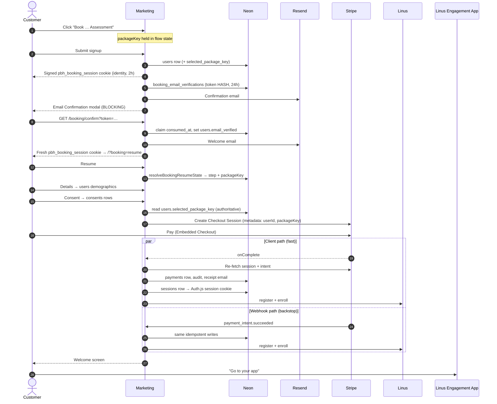
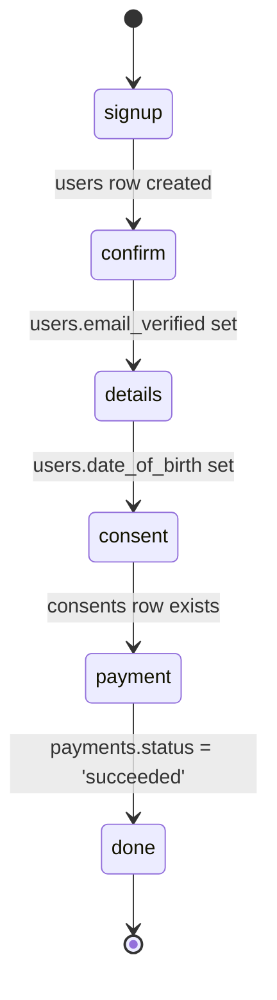

# Booking flow

How a customer goes from a package card on the marketing site to a paid,
enrolled account handed off to the Linus Engagement App, and what is written
along the way.

Kept next to the code on purpose: when the flow changes this should change in the
same PR, and it should be obvious when it hasn't.

---

## One app

Everything the customer touches is `apps/marketing`: the booking section, the
whole booking modal, Stripe Checkout, sign-in, the welcome screen, and the
**only** Stripe webhook endpoint. It uses `@pbh/db` (one Neon database),
`@pbh/booking/server` (every write path), `@pbh/emails`, `@pbh/linus` and
`@pbh/payments`.

There used to be a second app (`apps/app`) holding the post-payment product —
`/assessments`, report downloads, and its own Auth.js session. It was retired in
August 2026: Linus decided the **Linus Engagement App** is the entry point for
both PBH experiences, so the assessments and reports live there. Our surface now
ends at a welcome screen with a link out to it.

That deletion took a whole class of design with it. Marketing could not set the
other app's session cookie — different origins — which is why there was a signed
handoff token in the URL. Same origin now, so the post-payment sign-in is simply
a cookie set by the server action that verified the payment.

The booking cookie still exists and still matters: `pbh_booking_session`, signed
and HttpOnly, issued server-side at signup. Until the customer is signed in it is
the **only** thing that says which account a booking step may write to — see
`resolveBookingUserId`.

---

## The happy path

```mermaid
sequenceDiagram
    autonumber
    actor C as Customer
    participant M as Marketing
    participant DB as Neon
    participant R as Resend
    participant S as Stripe
    participant L as Linus
    participant E as Linus Engagement App

    C->>M: Click "Book … Assessment"
    Note over M: packageKey held in flow state
    C->>M: Submit signup
    M->>DB: users row (+ selected_package_key)
    M-->>C: Signed pbh_booking_session cookie (identity, 2h)
    M->>DB: booking_email_verifications (token HASH, 24h)
    M->>R: Confirmation email
    M-->>C: Email Confirmation modal (BLOCKING)

    C->>M: GET /booking/confirm?token=…
    M->>DB: claim consumed_at, set users.email_verified
    M->>R: Welcome email
    M-->>C: Fresh pbh_booking_session cookie → /?booking=resume

    C->>M: Resume
    M->>DB: resolveBookingResumeState → step + packageKey
    C->>M: Details → users demographics
    C->>M: Consent → consents rows

    M->>DB: read users.selected_package_key (authoritative)
    M->>S: Create Checkout Session (metadata: userId, packageKey)
    C->>S: Pay (Embedded Checkout)

    par Client path (fast)
        S-->>M: onComplete
        M->>S: Re-fetch session + intent
        M->>DB: payments row, audit, receipt email
        M->>DB: sessions row → Auth.js session cookie
        M->>L: register + enroll
    and Webhook path (backstop)
        S->>M: payment_intent.succeeded
        M->>DB: same idempotent writes
        M->>L: register + enroll
    end

    M-->>C: Welcome screen
    C->>E: "Go to your app"
```

---

## Where a customer resumes

The email-confirmation step is **blocking**, so every customer leaves the site and
comes back to a fresh page. Their step is therefore recomputed from persisted
state — never from anything the browser claims.

`resolveBookingResumeState` (`packages/booking/src/server/resume.ts`) is the
authority. If this diagram and that function disagree, the function is right.

```mermaid
stateDiagram-v2
    [*] --> signup
    signup --> confirm: users row created
    confirm --> details: users.email_verified set
    details --> consent: users.date_of_birth set
    consent --> payment: consents row exists
    payment --> done: payments.status = 'succeeded'
    done --> [*]
```

---

## Step by step

All server actions live in `apps/marketing/src/components/booking/actions.ts` and
`…/payment/actions.ts`; they are thin wrappers over shared cores in
`packages/booking/src/server/`.

| Step | Client | Action | Shared core | Writes |
|---|---|---|---|---|
| Landing | `BookingSection` → `PackageCard` | — | `ASSESSMENT_PACKAGES` | — (choice held in flow state) |
| Signup | `SignupForm` | `signupAction` | `createAccountCore` | `users` row incl. `selected_package_key`; audit `signup`; issues `pbh_booking_session` |
| — | — | — | `sendBookingConfirmation` | `booking_email_verifications`; audit `email_verification_sent` |
| Confirm | `EmailConfirmationStep` | `GET /booking/confirm` | `consumeBookingConfirmation` | `consumed_at`, `users.email_verified`; audit `email_verified` |
| Resume | `BookingStepFlow` (on mount) | `getBookingResumeState` | `resolveBookingResumeState` | — (read only) |
| Details | `DetailsForm` | `detailsAction` | `completeProfileCore` | `users` demographics (DOB, zip, state, phone, gender, education, patient names) |
| Consent | `ConsentForm` | `consentAction` | `recordConsentCore` | two `consents` rows — `wellness` + `hipaa_npp` — with `ip_hash` + `user_agent` |
| Payment | `PaymentStep` | `createAssessmentCheckoutSession` | `createCheckoutSessionCore` | audit `payment_pending`; Stripe Session |
| Fulfilment | — | `finalizeCheckoutSession` | `recordSucceededPayment` | `payments` row incl. `package_key`; audit `payment_succeeded` |
| Sign-in | — | `finalizeCheckoutSession` | `createSessionForUser` | `sessions` row; audit `login` (`method: post-payment`) |
| Enrollment | — | — | `registerAndEnrollUserById` | `users.linus_participant_id`, `linus_enrollments` |
| Welcome | `DoneStep` (or `/welcome`) | — | — | — (links out to the Engagement App) |

### The chosen package

Captured at signup and stored on `users.selected_package_key`, because the
confirmation gate destroys in-memory state before payment. That stored value —
not the key the client re-sends — is what `createCheckoutSessionCore` charges.
Trusting the client would let someone drive the $449 flow while checking out at
the $149 price, and fulfilment would accept it, since it validates the amount
against whichever package the client named.

### The welcome screen

One component, `EngagementAppCta`, rendered in two places: the modal's `done`
step for someone who just paid, and the `/welcome` route for someone returning
via a magic link. Keeping it single means the copy and the link can't drift.

`/welcome` allows two ways in, in order: an Auth.js session, or the booking
cookie plus a succeeded payment (`getEntitledTrack`). The second covers a
customer whose post-payment session mint failed, or who closed the modal and came
back, for the cookie's 2h life. It grants nothing beyond rendering an external
link.

The CTA target is `NEXT_PUBLIC_ENGAGEMENT_APP_URL`. Unset, the screen renders the
confirmation with **no button** and says the link will follow by email — a dead
button reads as a bug to someone who just paid. Being `NEXT_PUBLIC_*`, it is
inlined at build time: changing it needs a redeploy, not just an env edit.

---

## Fulfilment runs twice, on purpose

Two paths race after a successful payment, and either may win:

- **Client path** — Embedded Checkout's `onComplete` → `finalizeCheckoutSession`.
  Fast, gives the customer immediate feedback, and is the only path that signs
  them in (it is the one with a browser to set a cookie on).
- **Webhook path** — Stripe → `POST /api/stripe/webhook` →
  `handleStripeWebhook`. The source of truth; survives a browser that closed
  mid-flow.

Both call `recordSucceededPayment`, which is idempotent. Its `firstWrite` flag is
the exactly-once signal that gates the audit row, the receipt email, and
enrollment — so a redelivered event doesn't double-charge the audit log or email
the customer twice.

> The webhook is deliberately the **only** endpoint. Stripe endpoints are
> account-scoped and Stripe fans every event out to all of them, so a second one
> would process every payment twice. See the comment in
> `apps/marketing/src/app/api/stripe/webhook/route.ts`.

---

## Emails

All sends go through `packages/booking/src/server/send-email.ts`, which is
env-gated (`RESEND_API_KEY`), never throws, and writes an `email_sent` audit row.
Emails carry links only — never assessment results or report content.

| Email | Fired from | Trigger |
|---|---|---|
| Confirm your email | `email-verification.ts` | signup |
| Welcome | `email-verification.ts` | confirmation redeemed |
| Payment receipt | `fulfill.ts` | first `succeeded` write |
| Assessment ready | `register-and-enroll.ts` | first enrollment resolution |
| Payment refunded | `fulfill.ts` | `charge.refunded` |
| Magic link | `apps/marketing/src/auth.ts` | `/login` request |

Welcome deliberately fires on **confirmation**, not signup: the flow is blocked on
the confirmation link, and two emails arriving together buries the one the
customer has to act on.

Every link is built from `siteBaseUrl()` in `@pbh/emails` (`BOOKING_BASE_URL` →
`VERCEL_URL` → `localhost:3000`), except the "assessment ready" CTA, which points
at the Engagement App when one is configured.

There is no "report ready" email: reports are read in the Engagement App, which
owns notifying about them. The `has_report` bookkeeping stays, because it is what
stops us re-POSTing a finished enrollment.

---

## Three tokens, easily confused

| Token | Signed with | TTL | Single-use via |
|---|---|---|---|
| Email confirmation | none — random, SHA-256 hashed at rest | 24h | `booking_email_verifications.consumed_at` |
| Booking cookie (`pbh_booking_session`) | `BOOKING_RESUME_SECRET` | 2h | no — re-readable until expiry |
| Magic link | `AUTH_SECRET` (Auth.js) | 15 min | `verification_tokens` |

There used to be a fourth — the cross-app payment handoff, signed with
`AUTH_HANDOFF_SECRET`. It existed only to carry a session across an origin
boundary that no longer exists.

### Session lifetimes

Set from PBH's security review (Bill, 2026-07-22). HIPAA prescribes no specific
duration — it requires an automatic logoff control proportionate to the risk.

| Control | Value | Enforced by |
|---|---|---|
| Inactivity timeout | 15 min | Auth.js `session.maxAge` with `updateAge: 0` |
| Absolute session cap | 8 hours | our `getSessionAndUser` override — Auth.js has no built-in |
| Magic link | 15 min, single-use | provider `maxAge`; Auth.js deletes the token on redeem |

`maxAge` alone is a *sliding* window: it moves forward on every request, so a
continuously active session would never end. The absolute cap is the reason
`sessions.created_at` exists — `expires` cannot tell you a session's true age
once it has slid.

> These numbers were sized when the signed-in area reached the Linus report. It
> no longer reaches anything but an external link, so they are stricter than the
> risk now warrants. Left unchanged deliberately — loosening a
> compliance-signed-off control is Bill's call, not a side effect of this
> refactor.

---

## Alternative entry: magic link

Independent of booking. `/login` → `requestMagicLink` → Auth.js. The `signIn`
callback rejects addresses with no account (login-only, and it stops a
`verification_tokens` row being minted for a stranger); `requestMagicLink`
swallows the resulting `AccessDenied` so the response is identical either way and
cannot be used to discover who is registered. A redeemed link lands on
`/welcome`.

Used by anyone returning after the booking cookie has expired.

---

## Failure modes

Each of these has actually happened:

| Symptom | Cause |
|---|---|
| Signup or `/booking/confirm` throws | `BOOKING_RESUME_SECRET` missing — it signs the booking cookie |
| Every step after signup says "We couldn't find your booking" | The `pbh_booking_session` cookie is absent, expired (2h), or signed with a different `BOOKING_RESUME_SECRET` than the one reading it |
| Welcome screen has no button | `NEXT_PUBLIC_ENGAGEMENT_APP_URL` unset — or set *after* the build, since it is inlined at build time |
| No email arrives; flow stalls at the confirmation modal | `RESEND_API_KEY` unset — sends become logged no-ops and the confirmation URL is printed to the server console instead. This is how local testing works |
| "Couldn't register with Linus (status 500)" after payment | An `education` value outside Linus's configured set (0–18 or 21) — see `pbh-a0n` |
| Session silently never found | Cookie-name mismatch: Auth.js derives the `__Secure-` prefix from the request protocol, not `NODE_ENV` |

---

## Known gaps

Documented so nobody mistakes them for intent:

- **Comprehensive ($449) provisions exactly what Basic ($149) does** — the same
  three Linus campaigns. There is no per-package fulfilment, and the consent copy
  is still the wellness + HIPAA NPP text rather than anything written for a
  diagnostic service. Tracked on `pbh-eaj`.
- **No rate limiting on `requestMagicLink`** — an unauthenticated action that
  emails any registered address.
- **A deferred Linus registration has one fewer chance to complete.** The old
  `/assessments` page re-ran `registerAndEnrollUserById` on every load, so a
  registration deferred at payment time would finish the next time the customer
  looked. Now the webhook's `retryOnContention` retry is the only recovery: if it
  exhausts Stripe's redeliveries, the customer has a paid row and no Linus
  subject, and nothing notices.
- **Retired columns still in the schema** — `users.welcome_seen_at`,
  `users.password_hash`, `payments.handoff_consumed_at`. Left in place so a
  revert stays clean; a follow-up drops them.
