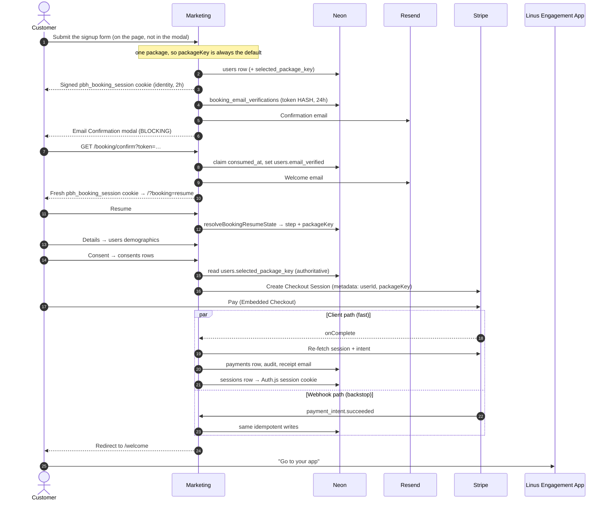
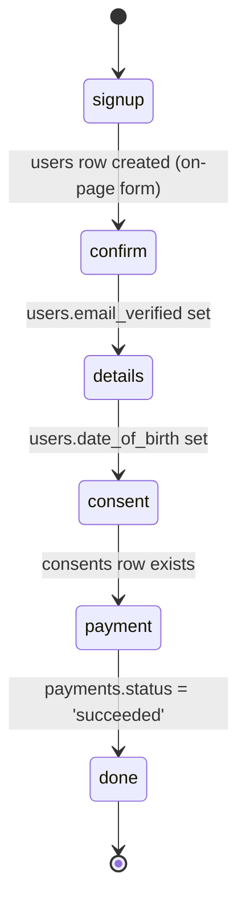

# Booking flow

How a customer goes from the signup form on the marketing home page to a paid
account handed off to the Linus Engagement App, and what is written along the way.

> **Linus registration happens in the Stripe webhook only** (pbh-73g). The
> customer-facing path records the payment, signs the customer in and sends them
> to `/welcome` without calling Linus; the webhook then registers + enrolls the
> payer out of band. That split is deliberate — an inline call is what stranded
> paying customers on the payment step during a Linus outage (pbh-ek8).

Kept next to the code on purpose: when the flow changes this should change in the
same PR, and it should be obvious when it hasn't.

---

## One app

Everything the customer touches is `apps/marketing`: the booking section, the
whole booking modal, Stripe Checkout, sign-in, the welcome screen, and the
**only** Stripe webhook endpoint. It uses `@pbh/db` (one Neon database),
`@pbh/booking/server` (every write path), `@pbh/emails` and `@pbh/payments`.
(`@pbh/linus` is reached only from the webhook, never from a page render.)

There used to be a second app (`apps/app`) holding the post-payment product —
`/assessments`, report downloads, and its own Auth.js session. It was retired in
August 2026: Linus decided the **Linus Engagement App** is the entry point for
both PBH experiences, so the assessments and reports live there. Our surface now
ends at a welcome screen with a link out to it.

That deletion took a whole class of design with it. Marketing could not set the
other app's session cookie — different origins — which is why there was a signed
handoff token in the URL. Same origin now, so the post-payment sign-in is simply
a cookie set by the server action that verified the payment.

The booking cookie still exists and still matters: `pbh_booking_session`, signed
and HttpOnly, issued server-side at signup. Until the customer is signed in it is
the **only** thing that says which account a booking step may write to — see
`resolveBookingUserId`.

---

## The happy path

```mermaid
sequenceDiagram
    autonumber
    actor C as Customer
    participant M as Marketing
    participant DB as Neon
    participant R as Resend
    participant S as Stripe
    participant E as Linus Engagement App

    C->>M: Submit the signup form (on the page, not in the modal)
    Note over M: one package, so packageKey is always the default
    M->>DB: users row (+ selected_package_key)
    M-->>C: Signed pbh_booking_session cookie (identity, 2h)
    M->>DB: booking_email_verifications (token HASH, 24h)
    M->>R: Confirmation email
    M-->>C: Email Confirmation modal (BLOCKING)

    C->>M: GET /booking/confirm?token=…
    M->>DB: claim consumed_at, set users.email_verified
    M->>R: Welcome email
    M-->>C: Fresh pbh_booking_session cookie → /?booking=resume

    C->>M: Resume
    M->>DB: resolveBookingResumeState → step + packageKey
    C->>M: Details → users demographics
    C->>M: Consent → consents rows

    M->>DB: read users.selected_package_key (authoritative)
    M->>S: Create Checkout Session (metadata: userId, packageKey)
    C->>S: Pay (Embedded Checkout)

    par Client path (fast)
        S-->>M: onComplete
        M->>S: Re-fetch session + intent
        M->>DB: payments row, audit, receipt email
        M->>DB: sessions row → Auth.js session cookie
    and Webhook path (backstop)
        S->>M: payment_intent.succeeded
        M->>DB: same idempotent writes
    end

    M-->>C: Redirect to /welcome
    C->>E: "Go to your app"
```

---

## Where a customer resumes

The email-confirmation step is **blocking**, so every customer leaves the site and
comes back to a fresh page. Their step is therefore recomputed from persisted
state — never from anything the browser claims.

`resolveBookingResumeState` (`packages/booking/src/server/resume.ts`) is the
authority. If this diagram and that function disagree, the function is right.

The modal owns four of these. Signup happens on the page, so a customer who has
not started yet has no modal to be at.

```mermaid
stateDiagram-v2
    [*] --> signup
    signup --> confirm: users row created (on-page form)
    confirm --> details: users.email_verified set
    details --> consent: users.date_of_birth set
    consent --> payment: consents row exists
    payment --> done: payments.status = 'succeeded'
    done --> [*]
```

---

## Step by step

All server actions live in `apps/marketing/src/components/booking/actions.ts` and
`…/payment/actions.ts`; they are thin wrappers over shared cores in
`packages/booking/src/server/`.

| Step | Client | Action | Shared core | Writes |
|---|---|---|---|---|
| Signup | `BookingSection` → `SignupForm`, on the page | `signupAction` | `createAccountCore` | `users` row incl. `selected_package_key`; audit `signup`; issues `pbh_booking_session` |
| — | — | — | `sendBookingConfirmation` | `booking_email_verifications`; audit `email_verification_sent` |
| Confirm | `EmailConfirmationStep` | `GET /booking/confirm` | `consumeBookingConfirmation` | `consumed_at`, `users.email_verified`; audit `email_verified` |
| Resume | `BookingStepFlow` (on mount) | `getBookingResumeState` | `resolveBookingResumeState` | — (read only) |
| Details | `DetailsForm` | `detailsAction` | `completeProfileCore` | `users` demographics (DOB, zip, phone, gender, education) + the account holder's name |
| Consent | `ConsentForm` | `consentAction` | `recordConsentCore` | two `consents` rows — `wellness` + `hipaa_npp` — with `ip_hash`, `user_agent` and the terms `version` |
| Payment | `PaymentStep` | `createAssessmentCheckoutSession` | `createCheckoutSessionCore` | audit `payment_pending`; Stripe Session |
| Fulfilment | — | `finalizeCheckoutSession` | `recordSucceededPayment` | `payments` row incl. `package_key`; audit `payment_succeeded` |
| Sign-in | — | `finalizeCheckoutSession` | `createSessionForUser` | `sessions` row; audit `login` (`method: post-payment`) |
| Welcome | `/welcome` route | — | — | — (links out to the Engagement App) |

### Who is being assessed

The account holder, always. Nobody is asked, and there is no second name on the
row to ask about: `users.patient_first_name` / `patient_last_name` were dropped
in migration 0022, because one person with two names is a pair that can disagree
— and the account settings card, which edits the account name, could rename a
Linus subject by writing them in step. The details step's name fields are the
account holder's own, prefilled from signup and written back in case they were
corrected, and `buildRegisterInput` registers that name.
`users.patient_identification` is the retired question (`pbh-4by`), now read by
nothing and kept only for the rows that answered it.

### The chosen package

Captured at signup and stored on `users.selected_package_key`, because the
confirmation gate destroys in-memory state before payment. That stored value —
not the key the client re-sends — is what `createCheckoutSessionCore` charges.
Trusting the client would let someone drive the $449 flow while checking out at
the $149 price, and fulfilment would accept it, since it validates the amount
against whichever package the client named.

### Which terms were agreed to

The agreement on the consent step is CMS-editable (the `Modals` collection's
`consent` document), and each `consents` row carries the version naming the text
that customer accepted. Those rows are append-only, so there is no correcting a
wrong one.

The version therefore travels with the terms rather than being looked up again:
`resolveConsentTerms` returns the two together — a version with no terms beside
it is dropped, not recorded — and the page that renders them mints a signed
`consentStamp` naming them. `consentAction` reads that stamp instead of
re-querying the CMS, so a submission is always recorded against the words that
were actually on screen, however stale the render. A stamp that is missing or
doesn't verify is refused (`CONSENT_STAMP_ERROR`) rather than falling back to a
guess.

Empty means the terms that ship in code, described by `CONSENT_VERSION` — the
normal state, since the CMS document starts empty.

### The welcome screen

The `/welcome` route, rendering `EngagementAppCta`, is where the flow ends.
Payment is the last step the modal owns: `PaymentStep`'s `onComplete` navigates
there rather than advancing to an in-modal confirmation, so the screen survives a
reload and a returning customer sees exactly the same thing. A booking resumed at
step `done` (already paid) is sent there too, instead of opening the modal.

`/welcome` allows two ways in, in order: an Auth.js session, or the booking
cookie plus a succeeded payment (`getEntitledTrack`). The second covers a
customer whose post-payment session mint failed, or who closed the modal and came
back, for the cookie's 2h life. It grants nothing beyond rendering an external
link.

The CTA target is `NEXT_PUBLIC_ENGAGEMENT_APP_URL`. Unset, the screen renders the
confirmation with **no button** — a dead button reads as a bug to someone who
just paid. Being `NEXT_PUBLIC_*`, it is inlined at build time: changing it needs a
redeploy, not just an env edit.

---

## Fulfilment runs twice, on purpose

Two paths race after a successful payment, and either may win:

- **Client path** — Embedded Checkout's `onComplete` → `finalizeCheckoutSession`.
  Fast, gives the customer immediate feedback, and is the only path that signs
  them in (it is the one with a browser to set a cookie on).
- **Webhook path** — Stripe → `POST /api/stripe/webhook` →
  `handleStripeWebhook`. The source of truth; survives a browser that closed
  mid-flow.

Both call `recordSucceededPayment`, which is idempotent. Its `firstWrite` flag is
the exactly-once signal that gates the audit row and the receipt email — so a
redelivered event doesn't double-charge the audit log or email the customer
twice.

The webhook — and only the webhook — then registers + enrolls the payer with
Linus (`registerAndEnrollUserById`, `retryOnContention: true`). It runs on every
delivery, not just `firstWrite`, because it is idempotent and a delivery that
recorded the payment but died before registering must still be covered.

Failure handling splits on the state's `retryable` flag, which is what keeps this
from repeating pbh-ek8: a transient failure (Linus 5xx/429, DB, a concurrent
registration still in flight) **throws** → 500 → Stripe redelivers, which is the
recovery mechanism; a permanent one (no date of birth, a Linus 4xx) is logged and acknowledged, because three days of redeliveries will not make
that subject valid. Either way the customer is already on `/welcome` and sees
none of it.

> The webhook is deliberately the **only** endpoint. Stripe endpoints are
> account-scoped and Stripe fans every event out to all of them, so a second one
> would process every payment twice. See the comment in
> `apps/marketing/src/app/api/stripe/webhook/route.ts`.

---

## Emails

All sends go through `packages/booking/src/server/send-email.ts`, which is
env-gated (`RESEND_API_KEY`), never throws, and writes an `email_sent` audit row.
Emails carry links only — never assessment results or report content.

| Email | Fired from | Trigger |
|---|---|---|
| Confirm your email | `email-verification.ts` | signup |
| Welcome | `email-verification.ts` | confirmation redeemed |
| Payment receipt | `fulfill.ts` | first `succeeded` write |
| Payment failed | `fulfill.ts` | first `failed` write |
| Payment refunded | `fulfill.ts` | `charge.refunded` |
| Magic link | `apps/marketing/src/auth.ts` | `/login` request |

Welcome deliberately fires on **confirmation**, not signup: the flow is blocked on
the confirmation link, and two emails arriving together buries the one the
customer has to act on.

Every link is built from `siteBaseUrl()` in `@pbh/emails` (`BOOKING_BASE_URL` →
`VERCEL_URL` → `localhost:3000`).

`sendAssessmentReadyEmail` still exists but nothing calls it: its only caller was
`register-and-enroll.ts`, now dormant. There is no "report ready" email either —
reports are read in the Engagement App, which owns notifying about them.

---

## Four signed values, easily confused

| Token | Signed with | TTL | Single-use via |
|---|---|---|---|
| Email confirmation | none — random, SHA-256 hashed at rest | 24h | `booking_email_verifications.consumed_at` |
| Booking cookie (`pbh_booking_session`) | `BOOKING_RESUME_SECRET` | 2h | no — re-readable until expiry |
| Consent stamp (`consentStamp` form field) | `BOOKING_RESUME_SECRET`, domain-tagged | none, by design | no — it is a label, not an authorization |
| Magic link | `AUTH_SECRET` (Auth.js) | 15 min | `verification_tokens` |

There used to be another — the cross-app payment handoff, signed with
`AUTH_HANDOFF_SECRET`. It existed only to carry a session across an origin
boundary that no longer exists.

The stamp and the cookie share a key, so each is signed over a domain tag
(`signing.ts`) — their formats both end in `.<hmac>`, and without the tag a
customer could paste their own cookie into the consent form and have it recorded
as the terms version.

### Session lifetimes

15-minute inactivity timeout, 8-hour absolute cap, 15-minute single-use sign-in
link — the automatic-logoff control set from PBH's compliance review. The values,
the reasoning, and what was considered and dropped live in
[`auth.md`](./auth.md#hipaa-automatic-logoff-controls); they are deliberately
recorded in one place so the numbers here can't drift from the ones in the code.

---

## Alternative entry: magic link

Independent of booking. `/login` → `requestMagicLink` → Auth.js. The `signIn`
callback rejects addresses with no account (login-only, and it stops a
`verification_tokens` row being minted for a stranger); `requestMagicLink`
swallows the resulting `AccessDenied` so the response is identical either way and
cannot be used to discover who is registered. A redeemed link lands on
`/welcome`.

Used by anyone returning after the booking cookie has expired.

---

## Failure modes

Each of these has actually happened:

| Symptom | Cause |
|---|---|
| Signup or `/booking/confirm` throws | `BOOKING_RESUME_SECRET` missing — it signs the booking cookie |
| Every step after signup says "We couldn't find your booking" | The `pbh_booking_session` cookie is absent, expired (2h), or signed with a different `BOOKING_RESUME_SECRET` than the one reading it |
| Welcome screen has no button | `NEXT_PUBLIC_ENGAGEMENT_APP_URL` unset — or set *after* the build, since it is inlined at build time |
| No email arrives; flow stalls at the confirmation modal | `RESEND_API_KEY` unset — sends become logged no-ops and the confirmation URL is printed to the server console instead. This is how local testing works |
| Session silently never found | Cookie-name mismatch: Auth.js derives the `__Secure-` prefix from the request protocol, not `NODE_ENV` |

`"Couldn't register with Linus (status …)"` no longer reaches a customer — it is
logged by the webhook instead. A 500 means an `education` value outside Linus's
set (`pbh-a0n`) and a 503 means Linus itself is down; the 503 is retried by
Stripe's redeliveries, the 500 is not (it is a permanent 4xx-class data problem
from our side and needs the row fixed).

---

## Known gaps

Documented so nobody mistakes them for intent:

- **A registration that never succeeds is only a log line.** The webhook retries
  transient failures through Stripe's redeliveries, but once those are exhausted
  (or the failure is permanent — no DOB, a Linus 4xx) the customer holds a paid
  row with no `linus_participant_id` and nothing notices. Needs an alert or a
  reconciliation job over that state; tracked on `pbh-3cy`.
- **Comprehensive ($449) provisions exactly what Basic ($149) does** — the same
  three Linus campaigns. There is no per-package fulfilment, and the consent copy is still the
  wellness + HIPAA NPP text rather than anything written for a diagnostic
  service. Tracked on `pbh-eaj`.
- **No rate limiting on `requestMagicLink`** — an unauthenticated action that
  emails any registered address.
- **Retired columns still in the schema** — `users.welcome_seen_at`,
  `users.password_hash`, `payments.handoff_consumed_at`. Left in place so a
  revert stays clean; a follow-up drops them.
