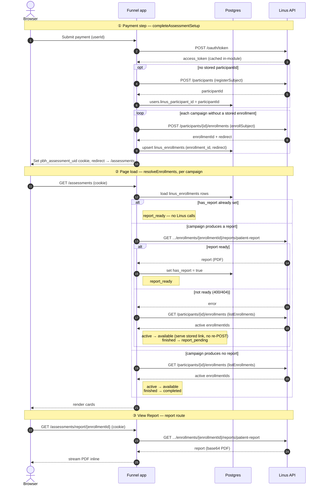

# Linus Health API integration

How the **funnel** app integrates the [Linus Health Public API](./Linus%20Health%20Public%20API.pdf):
what we call, what we persist, and when.

## Overview

A paid user is registered as a Linus **subject** (participant), **enrolled** in
each configured assessment campaign, and — once they finish an assessment — served
their **report** PDF. All Linus calls are server-only (they hold the OAuth secret
and Bearer token); nothing touches the client bundle.

The integration lives in:

- `apps/funnel/src/lib/linus/` — the API client, env/config, and the register payload builder.
- `apps/funnel/src/app/assessments/` — the page, server actions, the register/enroll engine, and the report route.
- `apps/funnel/src/db/schema/` — the `users` and `linus_enrollments` tables.

## Request flow

When each Linus call happens, and the DB writes around it.



A note on ②: a fresh `enrollSubject` POST happens only the first time a campaign is
seen (no stored row); on later loads we never re-POST an existing enrollment, and
`listEnrollments` is fetched lazily (at most once per request) only when a stored
enrollment still has no report. See [Per-card status resolution](#per-card-status-resolution).

## Configuration

`getLinusConfig()` (`lib/linus/env.ts`) requires these environment variables and
throws a single aggregated error listing any that are missing:

| Variable | Notes |
| --- | --- |
| `LINUS_CLIENT_ID` | OAuth client-credentials id |
| `LINUS_CLIENT_SECRET` | OAuth client-credentials secret (server-only) |
| `LINUS_BASE_URL` | API base, **includes the `/v1` segment** |
| `LINUS_TOKEN_URL` | OAuth token endpoint (separate from the base URL) |
| `LINUS_AUDIENCE` | OAuth audience |

Campaigns live in **code**, in `lib/linus/campaigns.ts` — the single source of
truth (they used to be a `LINUS_CAMPAIGNS` JSON env var). Everything
env-independent (display copy, ordering, `producesReport`) lives once in the
`CAMPAIGNS` map, keyed by `key`. The only thing that differs between the Linus
sandbox and production is the `campaignId`, kept in per-environment maps and
joined on read by `getCampaigns()`, which selects by `VERCEL_ENV` (`production` →
prod IDs; Preview and local dev → sandbox). Add or edit an assessment in one
place. A `CAMPAIGNS` entry:

```ts
DAC: {
  key: "DAC",                 // required: internal key (matches the id maps)
  name: "DAC / Digital …",     // required: card title
  description: "…",           // shown under the title
  duration: "less than 10 min", // shown by the CTA
  order: 0,                   // sort order; lowest first (first = "Start Here")
  infoUrl: "https://…",       // optional "Assessment Information" link
  producesReport: true,       // optional, defaults false; true only for campaigns
}                             //   Linus generates a patient report for (today: LHQ)
```

A campaign with no id for the active environment is omitted; an empty set → the
page shows an empty state.

## Endpoints we call

All wrapped in `lib/linus/client.ts`. Paths below are appended to `LINUS_BASE_URL`
(which already ends in `/v1`); the OAuth call uses the standalone `LINUS_TOKEN_URL`.

| Method · path | Wrapper | Purpose | Returns |
| --- | --- | --- | --- |
| `POST {LINUS_TOKEN_URL}` | `getAccessToken()` | OAuth client-credentials grant | `access_token` (cached in-module with a 60s safety margin) |
| `POST /participants` | `registerSubject(input)` | Register a subject | `Subject` (we keep `participantId`) |
| `POST /participants/{id}/enrollments` | `enrollSubject(participantId, campaignId)` | Enroll a subject in a campaign | `Enrollment` (`enrollmentId` + `redirect`) |
| `GET /participants/{id}/enrollments` | `listEnrollments(participantId)` | List **active** enrollments | `Enrollment[]` — used only for the active `enrollmentId` set (no `redirect`, see limitations) |
| `GET /participants/{id}/enrollments/{enrollmentId}/reports/{reportType}` | `getReport(...)` | Fetch a report | base64 PDF payload; `reportType` is always `patient-report`. `extractReportData()` pulls the base64 string out |

Every request goes through `linusRequest()`, which attaches `Authorization: Bearer
<token>`, `Accept: application/json`, an explicit `User-Agent:
PrimaryBrainHealth-Funnel/1.0` (the API sits behind a CloudFront WAF that blocks
empty user-agents), and `cache: "no-store"`. Non-2xx responses throw a
`LinusApiError` carrying the status and raw body.

## Register payload

`buildRegisterInput(user)` (`lib/linus/build-register-input.ts`) maps a `users`
row to the `POST /participants` body:

- `firstName`, `lastName`, `email` — pass-through.
- `sexAssignedAtBirth` — from `users.gender`; passed through when it's one of
  `MALE` / `FEMALE` / `INTERSEX` / `OTHER`, otherwise defaults to `OTHER`.
- `ageIndicator.birthDate` — from `users.dateOfBirth`. **Required** by Linus;
  throws `MissingDateOfBirthError` when null.
- `education` — included only when `users.educationLevel` is set (optional to Linus).
- `consent: true`.

`users.gender` and `users.educationLevel` already store canonical Linus enum
values, so this mapping is mostly pass-through.

## What we store, and when

### `users.linus_participant_id`

Set **once**, on the **payment step**: `completeAssessmentSetup`
(`assessments/actions.ts`) calls `registerAndEnrollUserById(userId)` with
registration allowed. If the user has no `participantId` yet,
`registerAndEnrollUser` (`register-and-enroll.ts`) calls `registerSubject` and
writes the returned id to the unique `linus_participant_id` column. A concurrent
double-submit can hit the unique constraint; we catch that and re-read the stored
id instead of failing.

Read paths never register: the `/assessments` page calls
`registerAndEnrollUserById(uid, { allowRegister: false })`, so loading the page
can't create a subject. (The manual email-lookup form is a testing/admin path and
does allow registration.)

### `linus_enrollments` rows

Per `(user, campaign)`, written by helpers in `register-and-enroll.ts`:

- **`upsertEnrollmentRow(...)`** — `insert … onConflictDoUpdate` on
  `(user_id, campaign_id)`, storing `enrollment_id` + `redirect`. Called only on
  the **first** enrollment of a campaign, right after `enrollSubject`.
- **`markReportReady(...)`** — flips `has_report` to `true` the first time a stored
  enrollment's report probe succeeds.

We never re-POST an enrollment that already has a row (see limitations).

### `pbh_assessment_uid` cookie

Identifies whose assessments/reports to serve. Set on **payment success** (and on
the manual form's success) with `ASSESSMENT_COOKIE_OPTS`: `httpOnly`, `secure` in
production, `sameSite: "lax"`, `path: "/"`, `maxAge` 1 hour. The value is the raw
(unsigned) user id — acceptable only for this unauthenticated scaffold; it should
move behind a real signed session once auth lands. Read by the `/assessments` page
and the report route (no cookie → redirect to `/assessments`).

## Per-card status resolution

On each `/assessments` load, `resolveEnrollments()` resolves every configured
campaign to one of three card states (`available`, `report_pending`,
`report_ready`):

1. Row has `has_report` → **report_ready**. No Linus calls.
2. Else probe `getReport` for the stored enrollment → if a report exists,
   `markReportReady` and show it (**report_ready**).
3. Else check `listEnrollments`:
   - stored enrollment still active → **available**; serve the stored `redirect`
     (**no re-POST**).
   - not active (completed, report still generating) → **report_pending**.
4. No row yet → `enrollSubject` + `upsertEnrollmentRow` → **available**.

`listEnrollments` is fetched lazily (at most once per request) and used only to
read the set of active `enrollmentId`s.

## Tables / schema

### `users` (Linus-relevant columns)

| Column | Type | Notes |
| --- | --- | --- |
| `linus_participant_id` | `text` | **unique**, nullable; set on first registration |
| `first_name`, `last_name` | `text` | not null; sent on register |
| `email` | `citext` | not null, unique; sent on register |
| `date_of_birth` | `date` | nullable in DB, **required** by Linus |
| `gender` | `text` | nullable; → `sexAssignedAtBirth` |
| `education_level` | `text` | nullable; → `education` |

`linus_participant_id` is added by migration `0002` (which also backfills
gender/education to canonical Linus enum values).

### `linus_enrollments`

| Column | Type | Notes |
| --- | --- | --- |
| `id` | `uuid` | PK, default random |
| `user_id` | `uuid` | not null, **FK → `users.id`** |
| `campaign_id` | `text` | not null |
| `enrollment_id` | `text` | not null |
| `redirect` | `text` | not null; the assessment link from the POST response |
| `has_report` | `boolean` | not null, default `false` |
| `created_at` | `timestamptz` | not null, default now |
| `updated_at` | `timestamptz` | not null, default now, `$onUpdate` |

Constraints: **unique** `(user_id, campaign_id)`; **index** on `user_id`.

Migration history: `0003` created the table → `0004` dropped it → `0005` recreated
it with `has_report` (the current definition). Migrations are applied by **CI on
the production deploy**, not run manually.

## Report delivery

`GET /assessments/report/[enrollmentId]` (`report/[enrollmentId]/route.ts`):

- Authed via the `pbh_assessment_uid` cookie; the report is fetched server-side
  under that user's own `participantId`, so a user can only read their own reports.
- On success, streams the PDF inline (`Content-Disposition: inline`) with a
  descriptive filename built from the user's name + the campaign key (e.g.
  `jane-doe-lhq-brain-health-report.pdf`).
- Every other state renders a friendly self-contained HTML page instead of leaking
  a raw upstream error: no/expired cookie → redirect to `/assessments`; unknown
  user → "report unavailable"; report not ready (Linus 400/404, or no PDF data) →
  "still generating".

## Known API limitations / open issues

- **`GET /enrollments` does not return `redirect`** (confirmed by Linus) — only the
  `POST .../enrollments` response includes the assessment link. We persist
  `redirect` from the POST and reuse it; the GET is used only to tell whether an
  enrollment is still active.
- **`enrollSubject` is only partially idempotent** — for an *assigned* enrollment a
  re-POST returns the existing enrollment id + link, but for a *started* one it
  mints a brand-new enrollment (new id + link). The API exposes no status to tell
  the two apart, so we never re-POST an enrollment we already have a row for —
  re-POSTing a started enrollment would orphan the in-progress assessment and its
  eventual report.
- **Only LHQ generates a patient report right now** (confirmed by Linus). `getReport`
  returning `404 "Report unavailable"` for the other campaigns (DAC, Personal
  Priorities) is expected — they are not configured to produce a `patient-report` at
  this time. Handled via the `producesReport` flag in `lib/linus/campaigns.ts` (defaults
  `false`): only LHQ sets it `true`. Campaigns left at the default skip the report
  probe and settle into the `completed` ("Completed") card state once finished, instead
  of spinning on `report_pending` forever. Set `true` if/when Linus starts generating a
  campaign's reports.
- **Report generation lag** — reports can take several minutes to become available
  after an assessment is submitted (LHQ included). A freshly completed assessment
  will briefly show `report_pending` before the report probe starts succeeding; this
  is normal, not an error.
