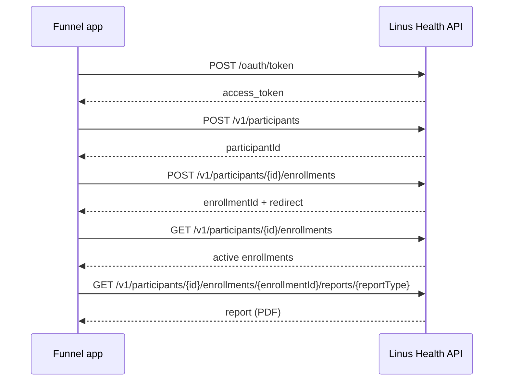

# Funnel → Linus Health API calls

The calls the funnel app makes to the Linus Health Public API, in order.

```mermaid
sequenceDiagram
  participant F as Funnel app
  participant L as Linus Health API

  F->>L: POST /oauth/token
  L-->>F: access_token

  F->>L: POST /v1/participants
  L-->>F: participantId

  F->>L: POST /v1/participants/{id}/enrollments
  L-->>F: enrollmentId + redirect

  F->>L: GET /v1/participants/{id}/enrollments
  L-->>F: active enrollments

  F->>L: GET /v1/participants/{id}/enrollments/{enrollmentId}/reports/{reportType}
  L-->>F: report (PDF)
```
