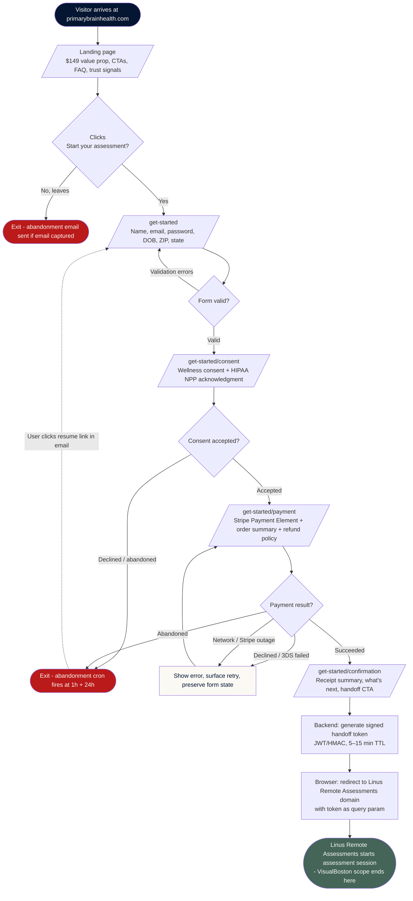
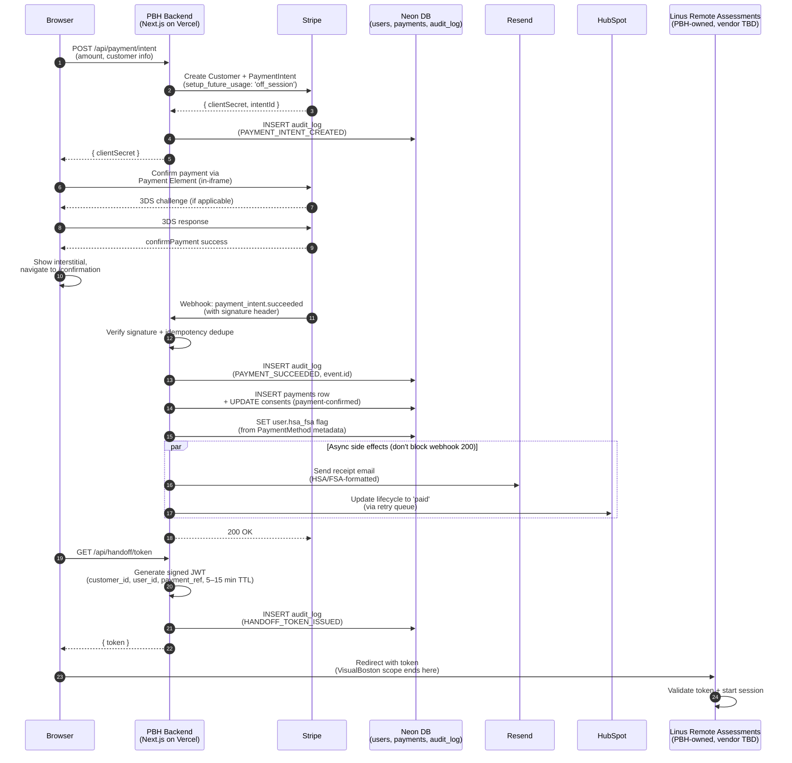
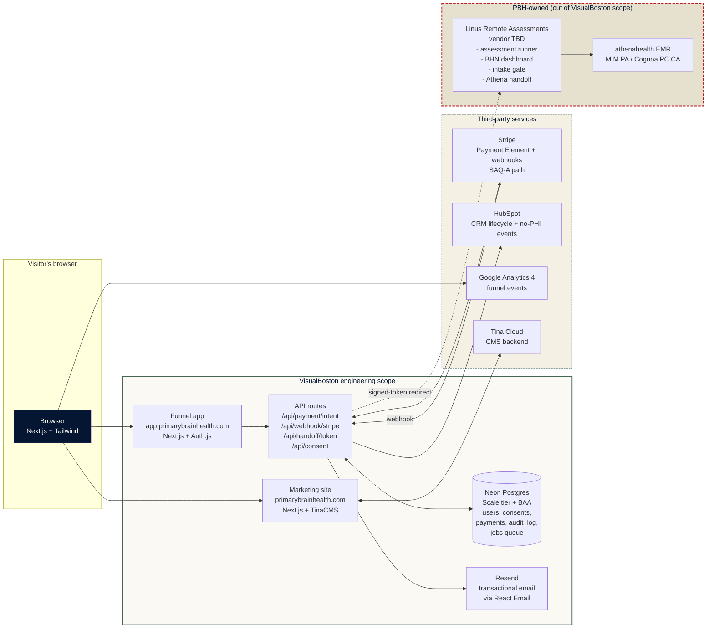

# Flow Diagrams - PBH Phase 2

Visual reference for the funnel + handoff. Mermaid syntax - renders in GitHub, GitLab, VS Code, Cursor, and most markdown viewers. Source-controllable, easy to edit.

Three diagrams:

1. [User funnel (happy + sad paths)](#1-user-funnel)
2. [Payment + handoff sequence (across systems)](#2-payment--handoff-sequence)
3. [System architecture overview](#3-system-architecture)

---

## 1. User funnel

Visitor journey from landing through the Stripe success → Linus Remote Assessments handoff. Includes abandonment + retry paths.

**Key events fired to GA4 along the way:**
`landing_viewed` → `cta_primary_clicked` → `signup_started` → `signup_completed` → `wellness_consent_signed` → `payment_started` → `payment_succeeded` (or `payment_failed`)

---

## 2. Payment + handoff sequence

What actually happens across systems when a user clicks Pay $149. This is the most complex interaction in the funnel and where most webhook + integration logic lives.

---

## 3. System architecture

High-level component map. Shows what VisualBoston builds vs. what PBH (or PBH's vendor TBD) owns.

**Legend:**
- 🟢 Cream box (VisualBoston scope) - we build, deploy, operate
- 🟡 Dashed yellow box (third-party services) - we integrate with, don't build
- 🔴 Dashed red box (PBH-owned scope) - out of scope, PBH or vendor TBD

The dotted arrow from API → Linus Remote Assessments is the **handoff seam** - VisualBoston's deliverable ends with the signed-token redirect. The Linus Remote Assessments and everything downstream is PBH's scope.

---

## How to edit / regenerate

These diagrams use [Mermaid](https://mermaid.js.org/) syntax. To view rendered:

- **GitHub**: renders inline in any `.md` file
- **VS Code / Cursor**: install the "Mermaid Preview" extension
- **Standalone**: paste into [mermaid.live](https://mermaid.live) for a quick edit + export to PNG/SVG

To add a new diagram, open a fenced code block with `mermaid` as the language and write the syntax. No build step required.
