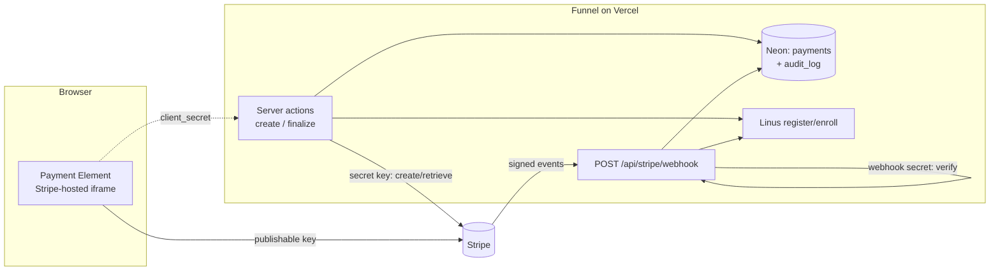
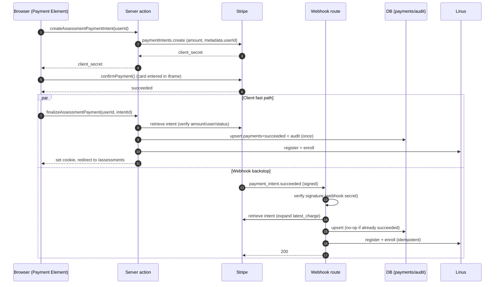
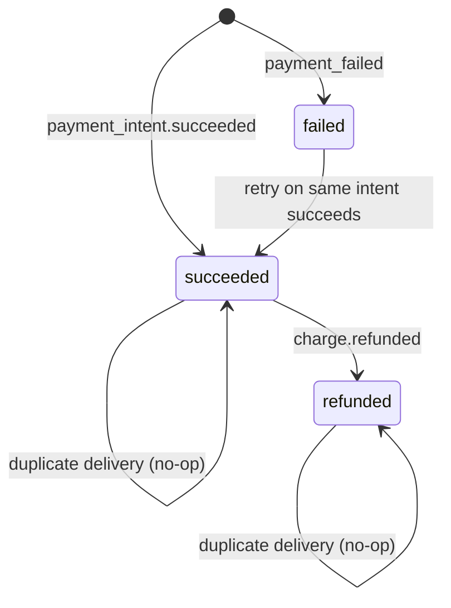

# Stripe Integration Reference — keys, endpoints & flow

Operational reference for the funnel's Stripe integration (issue `pbh-bws.28`):
what keys are required, what endpoints exist, and how a payment moves through the
system. For design rationale and the SAQ-A / HSA-FSA notes, see
[stripe-architecture.md](./stripe-architecture.md); this doc is the "wiring".

Scope: `apps/funnel`. Card data never touches PBH servers (Stripe-hosted Payment
Element); the backend only handles Stripe objects.

---

## 1. Required keys

Three keys, each set **per environment** (local `.env.local`, Vercel Preview,
Vercel Production). Use **test** keys everywhere except Production.

| Key | Where it lives | Exposure | What it's for |
| :---- | :---- | :---- | :---- |
| `STRIPE_SECRET_KEY` | server only | **secret** — never ship to client | Server-side Stripe SDK: create/retrieve PaymentIntents, verify webhook signatures |
| `NEXT_PUBLIC_STRIPE_PUBLISHABLE_KEY` | browser bundle | public (safe) | Loads Stripe.js + mounts the Payment Element in the browser |
| `STRIPE_WEBHOOK_SECRET` | server only | **secret** | Verifies inbound webhook events actually came from Stripe |

Key facts that trip people up:

- **`STRIPE_WEBHOOK_SECRET` is per-endpoint.** The `whsec_…` printed by
  `stripe listen` locally is **different** from each hosted endpoint's signing
  secret in the Stripe Dashboard. Local, Preview, and Production each need their
  own value.
- **Test vs live keys must match the mode of the webhook endpoint.** A test-mode
  endpoint's secret only verifies test-mode events.
- Missing `STRIPE_SECRET_KEY` → payments fail on first request. Missing
  `STRIPE_WEBHOOK_SECRET` → every webhook delivery returns `400`.

Accessors: `getStripeSecretKey()` / `getStripeWebhookSecret()` in
`src/lib/stripe/env.ts` throw a helpful error if their var is unset.

---

## 2. Endpoints

### Inbound (HTTP routes we expose)

| Method + path | Auth | Purpose |
| :---- | :---- | :---- |
| `POST /api/stripe/webhook` | Stripe signature (`stripe-signature` header) | Authoritative fulfillment + async lifecycle events. Must stay **public** — no cookie/session auth in front of it. |

### Server actions (RPC, not public HTTP)

| Action | File | Purpose |
| :---- | :---- | :---- |
| `createAssessmentPaymentIntent(userId)` | `src/app/get-started/payment/actions.ts` | Creates the PaymentIntent, returns its `client_secret` to the Payment Element |
| `finalizeAssessmentPayment(userId, intentId)` | same | Client fast path after confirm: re-verify → record → enroll → redirect |

### Outbound (calls we make to Stripe)

| Call | When |
| :---- | :---- |
| `paymentIntents.create(...)` | On reaching the payment step |
| `paymentIntents.retrieve(id, { expand: ['latest_charge'] })` | On client finalize + inside the webhook (re-verify + capture brand/last4) |
| `webhooks.constructEvent(rawBody, sig, secret)` | Every inbound webhook (signature verification) |

### Stripe → us: subscribed events

Register these on the Dashboard endpoint (and they're what `route.ts` switches on):

| Event | Effect |
| :---- | :---- |
| `payment_intent.succeeded` | record `succeeded` (+ brand/last4) → audit → register + enroll in Linus |
| `payment_intent.payment_failed` | record `failed` → audit |
| `charge.refunded` | record `refunded` → audit |

### External hosts in play

| Host | Role |
| :---- | :---- |
| `js.stripe.com` | Stripe.js + Payment Element iframe (loaded in the browser) |
| `api.stripe.com` | Server-side SDK calls |
| `<your-domain>/api/stripe/webhook` | Where Stripe POSTs events |

---

## 3. How it works

### 3.1 System overview (keys & who talks to whom)



### 3.2 Happy path (client stays on the page)

Both the client fast path and the webhook run; idempotent writes make the
overlap safe. The webhook typically lands a second or two after the client.



### 3.3 Backstop path (browser drops after charge)

The reason the webhook exists: fulfillment no longer depends on the client
returning.

```mermaid
sequenceDiagram
    autonumber
    participant B as Browser
    participant S as Stripe
    participant W as Webhook route
    participant D as DB
    participant L as Linus

    B->>S: confirmPayment() succeeded
    Note over B: tab closed / connection lost —<br/>finalize never runs
    S->>W: payment_intent.succeeded (signed)
    W->>D: record payments=succeeded + audit
    W->>L: register + enroll
    alt enrollment ok
        W-->>S: 200 (done)
    else enrollment fails (e.g. Linus down)
        W-->>S: 500 → Stripe retries w/ backoff
        Note over W,S: payment already recorded;<br/>retry re-attempts enroll (idempotent)
    end
    Note over B: user returns later via /login →<br/>already registered, sees assessments
```

### 3.4 Payment status state machine

`payments.status`, keyed on the unique `stripe_payment_intent_id`:



Transitions are guarded (`setWhere` / `WHERE status <> target`) so redeliveries
and the client/webhook race are no-ops, and each audit entry is written once.

---

## 4. Setup checklist

### Local

```bash
stripe login
stripe listen --forward-to localhost:3001/api/stripe/webhook   # prints whsec_…
```
1. Put the printed `whsec_…` in `apps/funnel/.env.local` as `STRIPE_WEBHOOK_SECRET`
   (alongside the test `STRIPE_SECRET_KEY` + `NEXT_PUBLIC_STRIPE_PUBLISHABLE_KEY`).
2. `pnpm --filter funnel dev`
3. Pay with test card `4242 4242 4242 4242`, any future expiry, any CVC.

### Vercel

1. **Stripe Dashboard → Developers → Webhooks → Add endpoint**
   - URL: `https://<domain>/api/stripe/webhook`
   - Events: `payment_intent.succeeded`, `payment_intent.payment_failed`, `charge.refunded`
   - Copy the endpoint's signing secret.
2. **Set env vars per environment** (Project → Settings → Environment Variables):
   `STRIPE_SECRET_KEY`, `NEXT_PUBLIC_STRIPE_PUBLISHABLE_KEY`, `STRIPE_WEBHOOK_SECRET`
   (test for Preview, live for Production; webhook secret = the hosted endpoint's).
3. **Preview caveat:** preview URLs change per deploy, so a static endpoint can't
   reach them — use `stripe listen` locally or a stable preview alias.
4. **Keep the route public** — if middleware (e.g. Clerk) is added, exclude
   `/api/stripe/webhook`.

No code changes are needed to deploy: the route is already serverless-ready
(`runtime = 'nodejs'`, raw-body read, `force-dynamic`).

---

## 5. Verifying it works

- **Stripe CLI / Dashboard:** delivery attempts show `200`. Re-send an event to
  confirm idempotency (still exactly one `payment_succeeded` audit row).
- **DB:**
  ```sql
  select status, amount_cents, card_brand, card_last4, stripe_payment_intent_id
  from payments order by created_at desc limit 5;
  select event_type, user_id, metadata from audit_log order by occurred_at desc limit 10;
  ```
